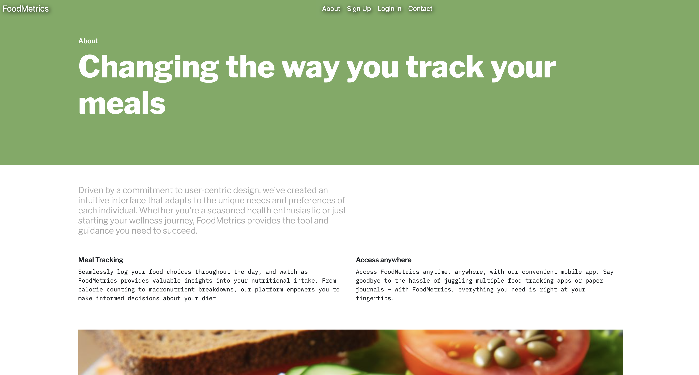
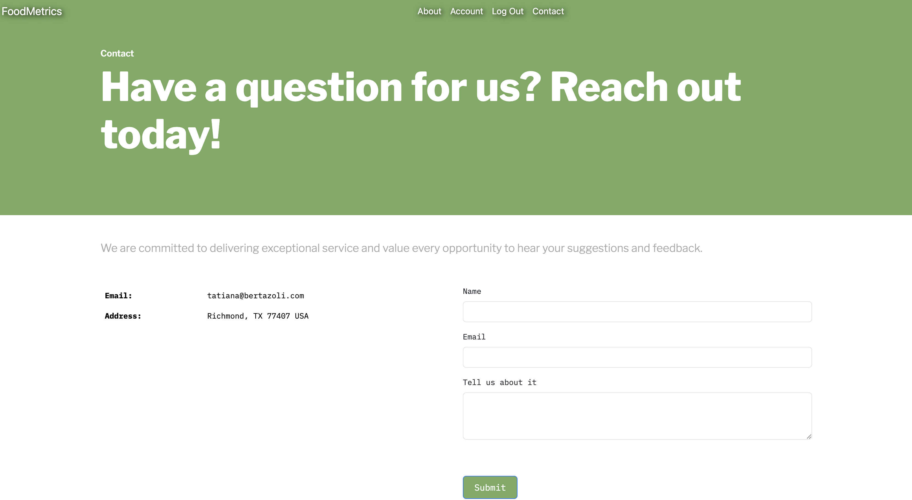
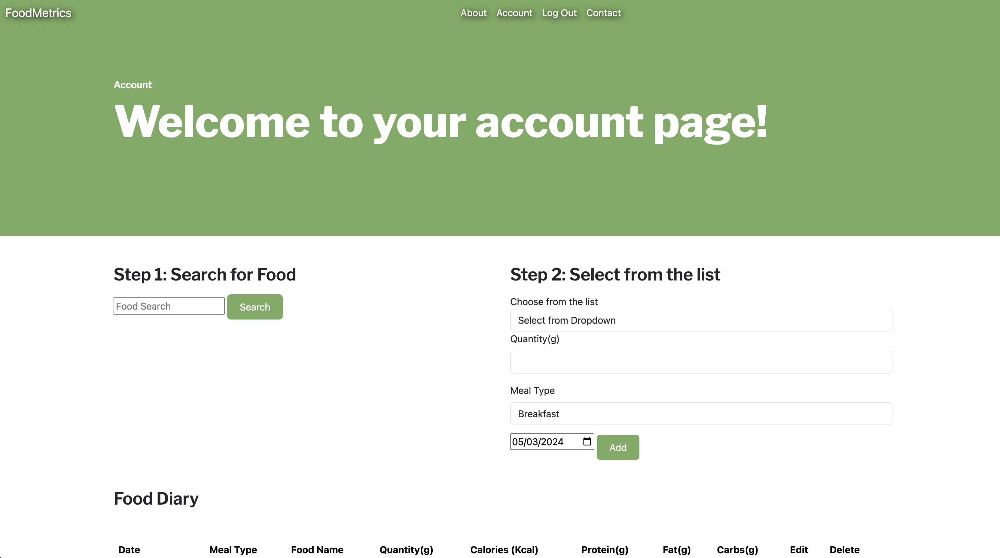

# FoodMetrics

## Screenshots

Landing Page

About Us Page

Contact Page

Account Page

## Description

FoodMetrics is a user-friendly online platform meticulously crafted to simplify the tracking of your nutritional intake. With FoodMetrics, you gain access to a secure and intuitive interface where you can effortlessly monitor your daily macronutrient consumption. Bid farewell to cumbersome spreadsheets and welcome a seamless approach to managing your dietary goals with FoodMetrics. Keeping track of your macros has never been easier. All images were AI generated.

## Table of contents

- [Description](#description)
- [Screenshots](#screenshots)
- [Technologies Used](#technologies-used)
- [Getting Started](#getting-started)
- [Credits](#credits)
- [Future Enhancements](#future-enhancements)
- [Questions](#questions)

## Technologies Used

- HTML
- CSS
- Python
- Bootstrap
- Django
- Neon
- AI

## Getting Started

1 - Access the [website](https://foodmacros-1443b0816711.herokuapp.com/).  
2 - Upon acessing the website the user can access the about me page and contact page.  
3 - To be able to access other features the user has to signup/login first.  
4 - After Login the user lands on the account page where he has access to the account features.  
5 - User can search a food from a list of food that is being populated from a third part API.  
6 - Before creating a new food the user has to type information like weight, meal type and quantity.  
7 - User can add/edit and delete food information from food tracker.  
8 - The macros are adjusted acordingly with the amount consumed.  
9 - Link to [trello](https://trello.com/invite/b/tVO3g2VX/ATTI183dd62c01f05a90f15d82b2e6ab6b9084B7EA33/foodmetrics) project planning.

## Credits

Tatiana Bertazoli

## Future Enhancements

1 - Improve the display food table to separate per day  
2 - Add water intake

## Questions

For questions please contact: tatianabertazoli@gmail.com

Heroku deployed [link](https://foodmacros-1443b0816711.herokuapp.com/)

GitHub repository [link](https://github.com/TBertazoli/foodmacros)
